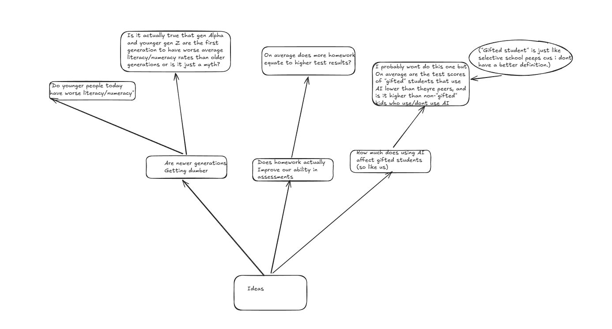

 
 # Data science project  
## Identifying and defining  
### Define your purpose: 
“Students who get higher amounts of homework do better in assignments.”  
## Mind map: 
### Research:   
Study1: [https://pmc.ncbi.nlm.nih.gov/articles/PMC11409198/](https://pmc.ncbi.nlm.nih.gov/articles/PMC11409198/)  
Study2:[https://docs.google.com/forms/d/e/1FAIpQLSd91Tn1xkxeJPR1pps0XekT7zeYNrFqVtwtrkHIYUWLwhZQiA/alreadyresponded](https://docs.google.com/forms/d/e/1FAIpQLSd91Tn1xkxeJPR1pps0XekT7zeYNrFqVtwtrkHIYUWLwhZQiA/alreadyresponded)  
Study3:[https://educationalneuroscience.org.uk/wordpress/2025/02/04/does-homework-work-the-science-of-when-and-how-to-approach-it/\#:\~:text=Simply%20increasing%20homework%20time%20does,24%5D%2C%20%5B26%5D](https://educationalneuroscience.org.uk/wordpress/2025/02/04/does-homework-work-the-science-of-when-and-how-to-approach-it/#:~:text=Simply%20increasing%20homework%20time%20does,24%5D%2C%20%5B26%5D).

### Discussion:  
I personally think (especially after reviewing the studies) that extremly high amounts of homework will have a direct correlation with worse results across all subjects, and a more sound amonut of homework will indicate that a student is challenged by and does well in a subject. As well as this, form what ive seen of my own survey so far, it seems that students who get more homework do tend to do worse

## Requirements outline:

### Use-Case

Actor: User

Goal: To allow the user to view the data in a more easily interpratable way.

Pre-requisites:
The data set has been pre-loaded.
The user has access to the system interface

Main flow:
1. User opens the program and is presented with a text based menu.
2. User selects one of the following options:
   a. View datasheet
   b. Specify data
   c. View visualisation
3. System outputs expected response.

Post-conditions:
User has viewed data
data has remained.

### Functional requirements:
The System should be able to load csv files as graphs and display data even if it has missing values.
The System should allow for the filtering of subjects grades vs their amount of homework. As well as comparing subjects to each other.
The System should display the averages of each subjects grades and home work levels.
The System should display data through the matplotlib graphs, specifically bar charts because i like them
The System should store final data set in the DSS csv file
The System should allow for the editing of the data in the DSS csv file
The system should not have errors.

### Non-funtional requirements:
user interface should be clear and easy to understand, the options should be self explanatory.
The system should not have errors.
The system should enure data is saved properly and is correctly edited.

Field Datatype Format for Display Description Example Validation

| Field | Type | Format | Desc | Eg | Validate |
| ----- | ---- | ------ | ---- | -- | -------- |
| Subject | str | XX...XX | The school subject | Maths, English | Can be any amount of characters but cannot include numbers. |
| Grade | str | X | The grade gotten | A, B, E | Must be a single character. |
| Homework rate | int64 | NN | The amount of homework gotten, reported by the student | 01, 06, 10 | A two digit number between 1 and 10 |

# Final Discussion

E grading students tend to say that they get significantly more homework when compared to B or C students, with A students being the most varied, with many highs and lows, suggesting to me that a sound amount of homework is beneficial but many students get too much homework and are negatively impacted by it, as supported by study 3\. In real life, studying too much can stress you out and lead to worse results. Perhaps that's what is happening with this homework, too much is being given to students who already believe they do worse at maths (and other subjects though the amount of homework was significantly less), stressing them out and actually making their results worse rather than better. Overall I think a general decrease in homework (not by much) might benefit students in their understanding of mathematics, though other subjects seem to be *mostly* fine.

### Analysis
